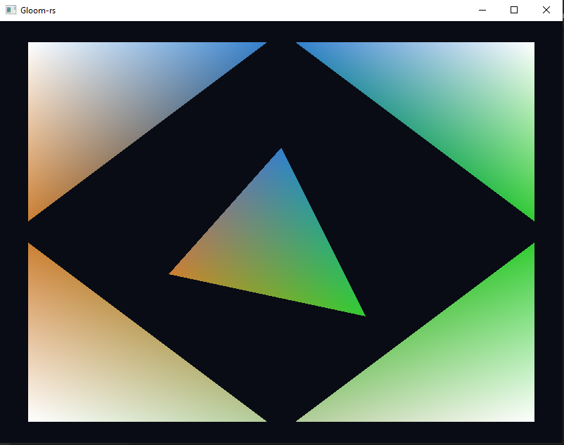
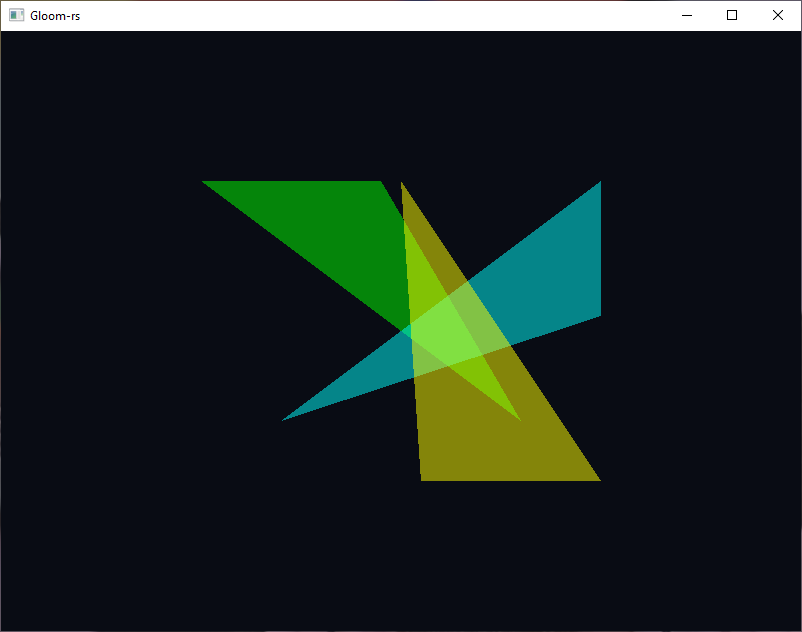

---
# This is a YAML preamble, defining pandoc meta-variables.
# Reference: https://pandoc.org/MANUAL.html#variables
# Change them as you see fit.
title: TDT4195 Exercise 2
author:
- Ola Fivelstad Smaaberg
date: \today # This is a latex command, ignored for HTML output
lang: en-US
papersize: a4
geometry: margin=4cm
toc: false
toc-title: "Table of Contents"
toc-depth: 2
numbersections: true
header-includes:
# The `atkinson` font, requires 'texlive-fontsextra' on arch or the 'atkinson' CTAN package
# Uncomment this line to enable:
#- '`\usepackage[sfdefault]{atkinson}`{=latex}'
colorlinks: true
links-as-notes: true
# The document is following this break is written using "Markdown" syntax
---

<!--
This is a HTML-style comment, not visible in the final PDF.
-->

# Task 1

## a)
In code

## b)

### i

OpenGL interpolates the correct value of the colors using barycentric coordinates. Barycentric coordinates expresses any coordinate on a triangle as a set of three scalars, one for the weight of each vertex in the triangle. The color value of each pixel is then calulated by taking the weighted average of each vertex color according to the barycentric coordinate. 

# Task 2

## a)

## b)

### i)
When changing the order of the colors, the last color to be drawn is major color for the overlapping part. 

### ii)

When swapping z-index only 2 of the colors appear to be blending. A depth test is performed on each pixel in the framebuffer comparing it to the current pixel on screen. If the pixel in the depth buffer has a higher value than the current one it is discarded. This explains why only 2 colors are blended in the overlapping region.

# Task 3

## a) 
in code

## b)
Changing the a value scales the x-axis

Changing the e value scales the y-axis

Changing the b value sheares the x-axis

Changing the d value sheares the y-axis

Changing the c value translates the x-axis

Changing the f value translates the y-axis

## c)
Shearing and scaling change the size of the triangles, which a rotation would not do. 