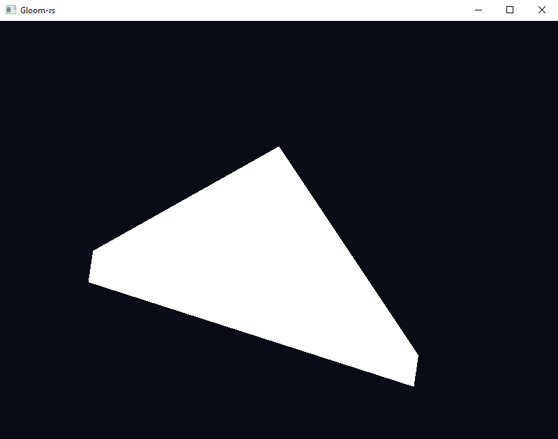
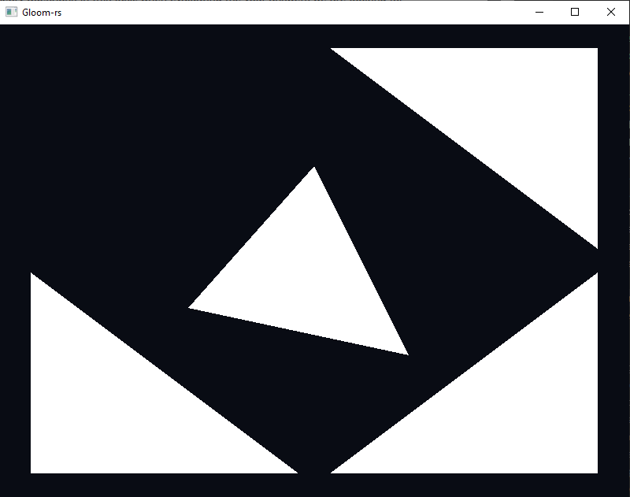
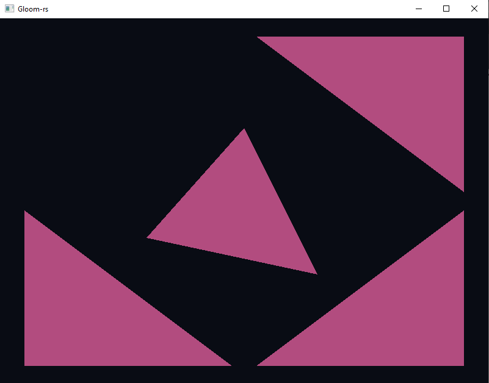
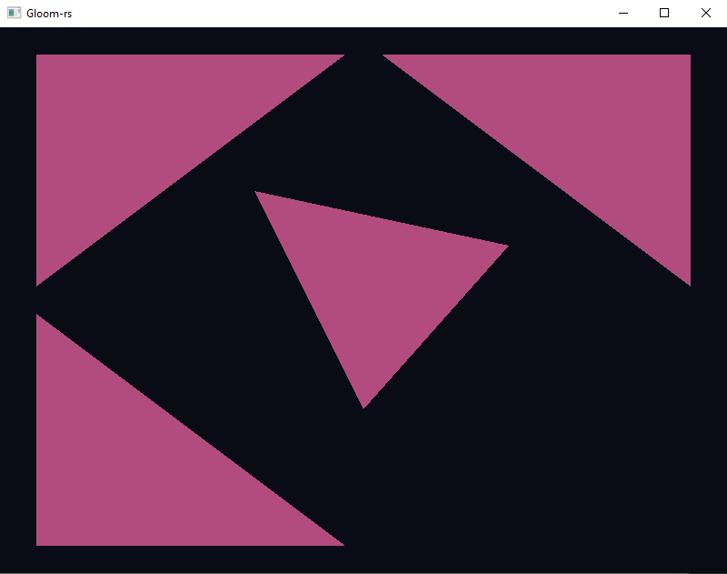

---
# This is a YAML preamble, defining pandoc meta-variables.
# Reference: https://pandoc.org/MANUAL.html#variables
# Change them as you see fit.
title: TDT4195 Exercise 2
author:
- Ola Fivelstad Smaaberg
date: \today # This is a latex command, ignored for HTML output
lang: en-US
papersize: a4
geometry: margin=4cm
toc: false
toc-title: "Table of Contents"
toc-depth: 2
numbersections: true
header-includes:
# The `atkinson` font, requires 'texlive-fontsextra' on arch or the 'atkinson' CTAN package
# Uncomment this line to enable:
#- '`\usepackage[sfdefault]{atkinson}`{=latex}'
colorlinks: true
links-as-notes: true
# The document is following this break is written using "Markdown" syntax
---

<!--
This is a HTML-style comment, not visible in the final PDF.
-->

# Task 1

## a)
In code

## b)

## c)

# Task 2

## a)

### i
The phenomenon is called clipping

### ii
Clipping occurs when the triangle is drawn outside the clip space, -1.0 to 1.0 in the x, y and z axis

### iii
Clipping is done for performance reasons, avoiding unnecessary rendering of geometry that the user cannot see.

## b)

### i
The triangle disappears

### ii
It happens because of culling. Culling is a technique used to prevent drawing sides of a 3d object which are not visible to the user which increases performance.

### iii
By default culling happens if the vertices of a triangle are not rendered in counter-clockwise order.

## c)

### i
The depth buffer is used to know which triengles should render on top of the other so that the correct one is visible in that single frame. If we dont clear the buffer some triangles might compare to the previous frame, which could cause some triangles to render when they should not - or vice versa. 

### ii
The fragment buffer runs one for every fragment in the scene. If there are more fragments than pixels, one pixel would be drawn to multiple times.

### iii
Vertex shaders and fragment shaders.
The vertex shaders transforms vertices and projects the scene to the camera. 
The fragment shader determines the color of every fragment in the scene. 

### iv
Index buffers are used so that one vertex can be used multiple times as connecting triangles have overlapping vertices.

### v
The offset is used in case you want to have multiple different attributes in the same vertex buffer. You would then specify the offset this attribute starts on.

## d)

### i
Changed the values of the color vector in the fragment shader.

### ii
Multiplied the position vector in the vertex shader by a vec4[-1,-1,1,1] to invert the x and y axis

